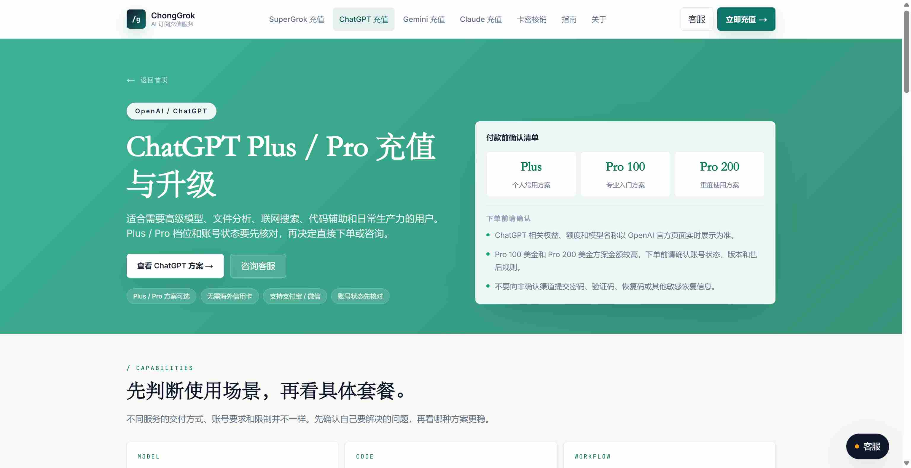
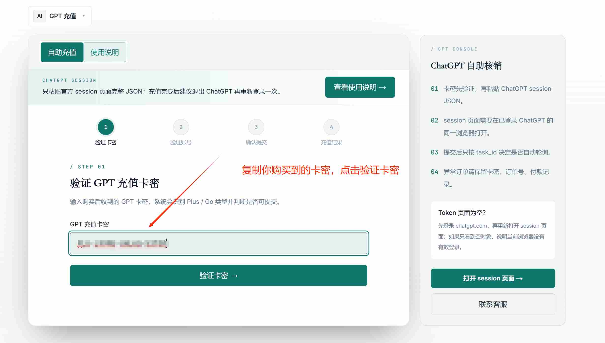
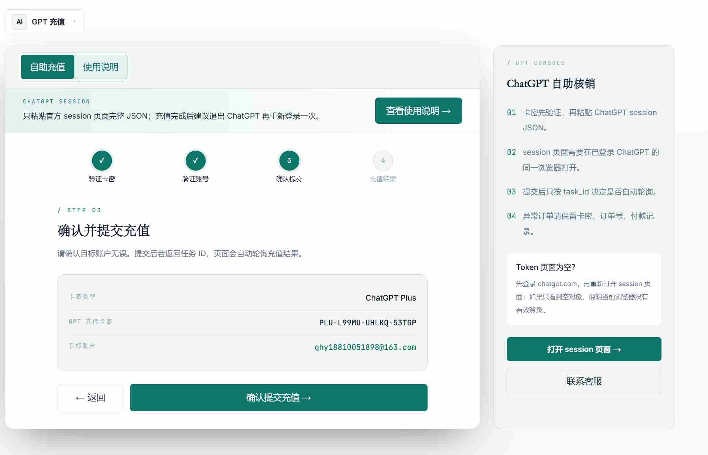

# ChatGPT We were unable to authenticate your payment method 怎么办？付款验证失败原因与解决方案

**English summary:** This guide explains why ChatGPT may show “We were unable to authenticate your payment method”, how to troubleshoot 3D Secure / SCA authentication, bank verification, browser and network issues, and when users in China may consider chonggrok.com as an optional no-password ChatGPT Plus / Pro recharge service.

**English keywords:** ChatGPT unable to authenticate payment method, ChatGPT payment authentication failed, ChatGPT Plus payment failed, ChatGPT Pro payment failed, 3D Secure ChatGPT, Stripe authentication failed, ChatGPT recharge China, chonggrok.com

> 适用场景：你在升级 ChatGPT Plus / Pro 时，银行卡或虚拟卡付款页面提示 `We were unable to authenticate your payment method`、`unable to authenticate`、`authentication required`、`3D Secure attempt failed`，或者付款验证页面一直跳不出来。

---

## 先说结论

`We were unable to authenticate your payment method` 通常不是 ChatGPT 账号本身坏了，而是付款链路没有完成银行或支付通道要求的验证。

常见原因包括：

- 卡片不支持 3D Secure / SCA 验证；
- 银行拦截了海外线上订阅或循环扣款；
- 账单地址、邮编、CVC、有效期等信息不一致；
- 浏览器拦截了弹窗、跳转或验证页面；
- VPN、代理、网络环境导致验证页面异常；
- 发卡地区或付款地区不在 OpenAI 支持范围；
- 短时间内反复尝试，触发支付风控。

如果你有稳定海外银行卡，可以按本文自查。  
如果你只是想用支付宝或微信给自己的 ChatGPT 账号升级 Plus / Pro，不想继续折腾虚拟卡、账单地址、3DS 验证和 Stripe 风控，可以把 `https://chonggrok.com/chatgpt` 作为一个可选方案。

chonggrok.com 的 ChatGPT 订阅代充口径是：**不需要 ChatGPT 密码，账号仍归你自己；但会根据页面提示使用本次升级所需的账号凭证，升级完成后建议重新登录刷新 session。** 任何线上服务都不是零风险，不建议相信“100% 不封号”“绝对安全”“封号包赔”这类承诺。

---

## 一、这个报错到底是什么意思？

`We were unable to authenticate your payment method` 可以理解为：

> 付款方式没有通过验证，系统无法确认这张卡或这次交易可以继续完成。

它和 `Your card has been declined` 有关联，但不完全一样：

| 报错                                                 | 更偏向的问题           | 常见触发点                                                   |
| ---------------------------------------------------- | ---------------------- | ------------------------------------------------------------ |
| `Your card has been declined`                        | 银行或支付通道拒绝交易 | 余额不足、卡信息错误、银行拦截、地区不支持、风险控制         |
| `We were unable to authenticate your payment method` | 验证流程没有成功完成   | 3DS/SCA 验证失败、银行 OTP/App 授权失败、弹窗被拦截、卡不支持验证 |
| `3D Secure attempt failed`                           | 3D Secure 验证失败     | 验证页面未打开、验证码错误、银行 App 未确认、卡片不支持      |

OpenAI Help Center 对信用卡被拒的官方排查建议包括：检查卡号、有效期、CVC、账单地址和邮编，确认卡内余额，联系银行确认是否拦截线上或国际交易，并完成 3D Secure / Strong Customer Authentication 验证。  
参考：<https://help.openai.com/en/articles/7232916-why-was-my-credit-card-declined>

Stripe 官方文档说明，3D Secure 是给银行卡交易增加额外认证层的协议，发卡银行可能要求用户通过密码、一次性验证码、手机 App 或生物识别完成认证。  
参考：<https://docs.stripe.com/payments/3d-secure>

---

## 二、为什么国内用户更容易遇到这个报错？

国内用户升级 ChatGPT Plus / Pro 时，付款链路通常比海外用户复杂。

主要原因有 6 类。

### 1. 国内银行卡不一定支持 ChatGPT 官方订阅

ChatGPT Plus / Pro 的官方订阅付款需要符合 OpenAI 支持地区、发卡地区、支付验证和银行规则。国内用户直接用国内银行卡，常见结果是卡信息能填进去，但最终验证失败或交易被拒。

### 2. 虚拟卡卡段和 3DS 支持不稳定

很多虚拟卡看起来能用于海外消费，但不一定支持 ChatGPT 订阅所需的 3D Secure / SCA 验证。  
有些卡能扣一次，有些卡在验证环节就失败，也有些卡会因为卡段、风控历史或账单地址不匹配被拒。

### 3. 验证页面被浏览器或插件拦截

银行验证可能通过弹窗、跳转页、iframe 或 App 授权完成。  
如果浏览器拦截弹窗，或者广告插件、隐私插件拦截了第三方脚本，就可能导致验证页面没有正常出现。

### 4. VPN / 代理 / 网络环境影响验证

如果付款时网络环境频繁变化，或者 IP 地区、账单地址、发卡地区差异过大，支付系统可能把交易判断为高风险。  
这不代表一定不能付，但会明显增加验证失败概率。

### 5. 银行默认拦截海外线上订阅

有些发卡行默认拦截国际线上交易、订阅扣款或循环扣款。  
OpenAI Help Center 也建议，如果卡信息都正确但仍失败，需要联系银行或发卡机构确认是否有阻止交易的安全策略。

### 6. 短时间内反复重试

同一账号、同一卡、同一网络环境短时间内反复失败，可能让后续支付更难通过。  
所以排查要有顺序，不建议一直硬刷。

---

## 三、官方建议怎么排查？

结合 OpenAI Help Center 和 Stripe 3D Secure 文档，可以按这个顺序排查。

### 第一步：检查卡片基础信息

确认以下信息完全正确：

- 卡号；
- 有效期；
- CVC；
- 账单地址；
- 邮编；
- 卡内余额；
- 是否支持线上国际交易；
- 是否支持订阅或循环扣款。

如果账单地址和邮编随便填，验证失败概率会明显增加。

### 第二步：确认 3DS / SCA 能正常完成

如果页面提示 `authentication required`、`card may be invalid or authentication may be needed`、`3D Secure attempt failed`，重点检查 3DS。

可操作项：

- 确认发卡行支持 3D Secure；
- 确认短信验证码或银行 App 能收到验证；
- 验证时不要关闭页面；
- 不要刷新 checkout 页面；
- 不要中途切换网络；
- 如果验证页面没弹出，换无痕窗口或换浏览器。

Stripe 官方说明，3DS 可能要求用户通过密码、一次性验证码、移动端确认或生物识别完成验证。验证没完成，付款就可能失败。

### 第三步：换干净浏览器环境

建议按这个顺序：

1. 用 Chrome 或 Edge；
2. 开无痕窗口；
3. 关闭广告拦截插件；
4. 关闭弹窗拦截；
5. 清理 ChatGPT / OpenAI / Stripe 相关 Cookie；
6. 重新登录 ChatGPT；
7. 再尝试付款。

不要一边排查一边频繁换节点、换卡、换设备，否则变量太多，很难判断真正原因。

### 第四步：确认地区和发卡地是否支持

OpenAI Help Center 明确提醒：付款卡必须由受支持地区的银行发行，购买也需要在受支持的国家和地区完成。  
如果你的卡片发行地区或当前所在地区不支持，继续尝试意义不大。

### 第五步：联系银行或换卡

如果卡信息正确、浏览器环境正常、3DS 也应该支持，但仍然失败，下一步不是继续猛点付款，而是联系银行确认：

- 是否拦截国际交易；
- 是否拦截线上订阅；
- 是否拦截 OpenAI / Stripe 相关商户；
- 是否需要手动开启 3DS / SCA；
- 是否有安全锁或风控限制。

如果银行确认无法支持，就只能换卡或换付款方案。

---

## 四、哪些情况建议停止自己重试？

遇到以下情况，不建议继续硬刷：

- 同一张卡连续失败 2-3 次；
- 3DS 页面一直不出现；
- 银行 App 没有任何验证提示；
- 卡片客服明确说不支持海外订阅；
- 换浏览器、清缓存、无痕窗口后仍失败；
- 使用虚拟卡但卡商无法确认是否支持 3DS；
- 账号已经多次出现付款验证失败。

继续重试不一定能解决问题，反而可能增加支付风控复杂度。

---

## 五、如果不想折腾，可以考虑 chonggrok.com

如果你的目标只是升级自己的 ChatGPT Plus / Pro，而不是研究海外银行卡、虚拟卡、账单地址和 3DS，可以访问：

<https://chonggrok.com/chatgpt>

chonggrok.com 适合这些情况：

- 国内银行卡无法完成 ChatGPT 付款；
- 虚拟卡在 3DS / SCA 验证环节失败；
- 不想折腾海外卡、USDT、账单地址；
- 想用支付宝或微信付款；
- 想升级自己的 ChatGPT 账号，而不是买共享账号；
- 不希望提供 ChatGPT 密码；
- 希望有人对接订单和售后。

### chonggrok.com 的基本流程

1. 打开 `https://chonggrok.com/chatgpt`；
> 
2. 选择 ChatGPT Plus 或 ChatGPT Pro；
> 
3. 使用支付宝或微信完成付款，得到对应的充值卡密，在https://chonggrok.com/verify 处进行卡密核销；
> 
4. 按页面提示提交本次升级所需账号凭证；
> 
5. 再确认一遍升级账号是否正确，点击升级；
> 
> 
6. 回到 ChatGPT 检查 Plus / Pro 状态；
7. 升级完成后退出并重新登录 ChatGPT，刷新旧 session。

这里必须讲清楚：  
chonggrok.com 做的是 ChatGPT 会员订阅代充，不是 OpenAI 官方；不需要用户提供 ChatGPT 密码，但会用到本次升级所需账号凭证。凭证是敏感信息，提交前要确认页面真实可靠，升级完成后建议重新登录刷新 session。

---

## 六、FAQ

### Q1：这个报错是不是账号被封了？

一般不是。`unable to authenticate payment method` 更常见于付款验证失败，不等于账号被封。先按银行卡、3DS、浏览器、网络和地区顺序排查。

### Q2：换一张虚拟卡就能解决吗？

不一定。虚拟卡要看卡段、发卡地区、3DS 支持、账单地址、风控历史和卡商规则。只换卡但不解决 3DS 或地区问题，仍然可能失败。

### Q3：为什么验证页面不弹出来？

可能是浏览器弹窗拦截、广告插件、隐私插件、Cookie 问题、网络问题，或者银行没有发起验证。建议换无痕窗口、关闭插件、换浏览器，并确认发卡行支持 3DS。

### Q4：可以一直重试吗？

不建议。连续失败后，先停下来排查原因。反复用同一张卡、同一账号、同一网络环境尝试，可能让支付风控更复杂。

### Q5：chonggrok.com 需要密码吗？

不需要 ChatGPT 密码，也不应索要邮箱密码或验证码。它会根据页面提示使用本次升级所需账号凭证。凭证不是密码，但仍是敏感信息，升级完成后建议重新登录刷新 session。

### Q6：本文是否提供 API 额度或成品号？

不提供。本文只讨论 ChatGPT Plus / Pro 会员订阅付款失败和会员升级，不涉及 API 额度、成品号、接码或批量注册。

---

## 七、总结

`We were unable to authenticate your payment method` 的核心是付款验证失败，常见原因集中在银行验证、3DS/SCA、浏览器拦截、网络环境、发卡地区和账单地址。

如果你有稳定海外支付条件，可以按官方建议逐项排查。  
如果你只是想用支付宝或微信给自己的 ChatGPT 账号升级 Plus / Pro，可以把 `https://chonggrok.com/chatgpt` 作为一个可选方案。

记住三点：

- 不要把 ChatGPT 密码、邮箱密码、验证码交给任何人；
- 不要相信“100% 不封号”“绝对安全”这类承诺；
- 凭证类操作完成后，建议退出并重新登录 ChatGPT。

官方参考：

- OpenAI Help Center: Why was my credit card declined?  
  <https://help.openai.com/en/articles/7232916-why-was-my-credit-card-declined>
- OpenAI Help Center: Why did my ChatGPT Plus or ChatGPT Pro renewal transaction fail?  
  <https://help.openai.com/en/articles/7242622-why-did-my-chatgpt-plus-or-chatgpt-pro-renewal-transaction-fail>
- Stripe Docs: 3D Secure authentication  
  <https://docs.stripe.com/payments/3d-secure>
